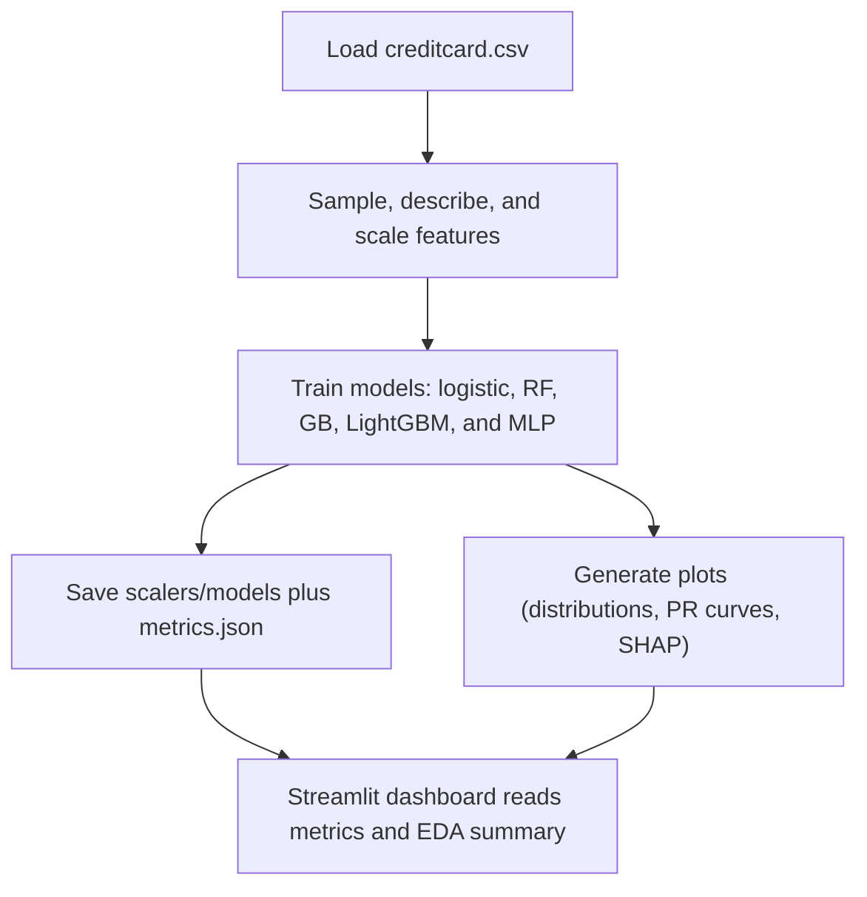

# Credit Card Fraud Detection

This project analyzes the anonymized `creditcard.csv` dataset (284,807 transactions with 492 frauds) to build a reproducible pipeline covering EDA, preprocessing, several classifiers (Logistic Regression, Random Forest, Gradient Boosting, LightGBM, and an MLP), and evaluation that highlights the Area Under the Precision-Recall Curve (AUPRC) instead of accuracy.
هذا المشروع يعالج بيانات `creditcard.csv` المجهولة (284,807 معاملة فيها 492 احتيال) عبر خط أنابيب متكرر يشمل التحليل الاستكشافي، المعالجة، تدريب نماذج متعددة، وتقييم معتمد على AUPRC بدل الدقة.

## Repository layout

- `creditcard.csv` - raw dataset from the ULB/Worldline research collaboration.
  `creditcard.csv` هو مصدر البيانات الأصلي من تعاون ULB/Worldline.
- `requirements.txt` - pinned libraries used across the pipeline, dashboard, and explainability scripts.
  `requirements.txt` يحدد المكتبات المطلوبة لتشغيل الأنابيب والواجهة والتفسيرات.
- `src/project_pipeline.py` - command-line pipeline that runs sampling, scaling, training, visualizations, SHAP summaries, and metadata exports.
  `src/project_pipeline.py` يقرأ البيانات، يعالجها، يدرّب النماذج، ويصدر المقاييس والرسوم.
- `reports/eda_summary.md` - automatically generated markdown describing class balance, stats, and top-correlated features.
  `reports/eda_summary.md` يوّثق توازن الفئات والإحصاءات والميزات ذات الارتباط.
- `outputs/` - serialized scalers/models (`.joblib`) plus `metrics.json` that stores AUPRC, precision, recall, and classification reports.
  `outputs/` يحتوي السكالر والموديلات المحفوظة و`metrics.json` بالمقاييس.
- `plots/` - PNGs for class distribution, hourly transaction breakdown, time/amount distributions, boxplots, correlation heatmaps, SHAP summaries, and PR curves.
  `plots/` يضم صور التوزيعات، المخطط الساعي، مخططات SHAP، ومنحنيات PR لكل نموذج.
- `app.py` - Streamlit dashboard that loads the EDA summary, metrics, and visuals for quick inspection.
  `app.py` هي واجهة Streamlit لعرض الملخصات والمقاييس والرسوم.
- `operations.md` - sequence for refreshing the dataset, rerunning the pipeline, and updating the dashboard.
  `operations.md` يشرح خطوات تحديث البيانات، إعادة التشغيل، وتزامن الواجهة.

## Setup

1. Create and activate a Python 3.12 (or newer) environment.
2. `pip install -r requirements.txt`
   أنشئ وفعّل بيئة Python 3.12 أو أحدث، ثم ثبّت الحزم بالأمر أعلاه.

## Running the pipeline

```bash
python src/project_pipeline.py
```

By default the script caps the dataset to 100,000 rows (`--max-samples`) to keep runtime reasonable while preserving the class imbalance structure; set the flag higher (or `0` to disable sampling) if you want to process everything. The command produces:  
يقيّد السكربت البيانات إلى 100,000 صف افتراضياً (`--max-samples`) لتقليل زمن التنفيذ مع الحفاظ على مشكل التوازن بين الفئات؛ زوّد القيمة أو حدد `0` لمعالجة كامل البيانات.

- `reports/eda_summary.md` with the sample size, class counts, key statistics for `Time`/`Amount`, and the PCA features most correlated with fraud.
  `reports/eda_summary.md` يعرض حجم العينة، توزيع الفئات، إحصاءات الوقت/المبلغ، وأهم الميزات المرتبطة باللاحتيال.
- `plots/` with `class_distribution.png`, `hourly_distribution.png`, `time_density.png`, `amount_density.png`, `amount_boxplot.png`, `V17_V14_scatter.png`, `feature_correlations.png`, `shap_summary_<best_model>.png`, and `pr_curve_<model>.png` for every classifier.
  `plots/` يحوي صور التوزيعات، الرسم الساعي، مخططات SHAP، ومنحنيات PR لكل نموذج.
- `outputs/metrics.json` (AUPRC, average precision, classification reports), plus saved scaler/model artifacts for each learner.
  `outputs/metrics.json` يسجل AUPRC والدقة والاستدعاء وتقارير التصنيف ويحتفظ بالموديلات المحفوظة.

## Dashboard

To explore the metrics and visuals interactively, launch the Streamlit application:

```bash
streamlit run app.py
```

It reads `reports/eda_summary.md`, `outputs/metrics.json`, and every PNG under `plots/` so you can browse the dataset overview, model comparison table, and generated charts in one place.
تقرأ الواجهة `reports/eda_summary.md`، `outputs/metrics.json`، وكل الصور في `plots/` حتى تسمح بتصفح الملخص، المقارنة، والرسوم بصرياً.

Use the sidebar language selector (`English` / `العربية`) to toggle the UI text.  
استخدم أداة اختيار اللغة في الشريط الجانبي (`English` / `العربية`) لتبديل نص الواجهة.

## Pipeline overview



## Explainability

After training the models, the pipeline selects the best AUPRC performer and writes a SHAP summary plot (`plots/shap_summary_<model>.png`). Open that image to understand which features most influence the model’s fraud predictions (the same image is visible inside the Streamlit dashboard).

## Next steps (suggested)

1. Integrate imbalanced-data techniques (`imblearn`, threshold tuning, or cost-sensitive sampling) and compare their effect on recall.
2. Enrich the dashboard with user-selected transactions or filtering so analysts can deep-dive into suspicious clusters.
3. Use the saved SHAP summary to build per-transaction explanations (LIME/SHAP force plots) and surface them in the dashboard for transparency.
