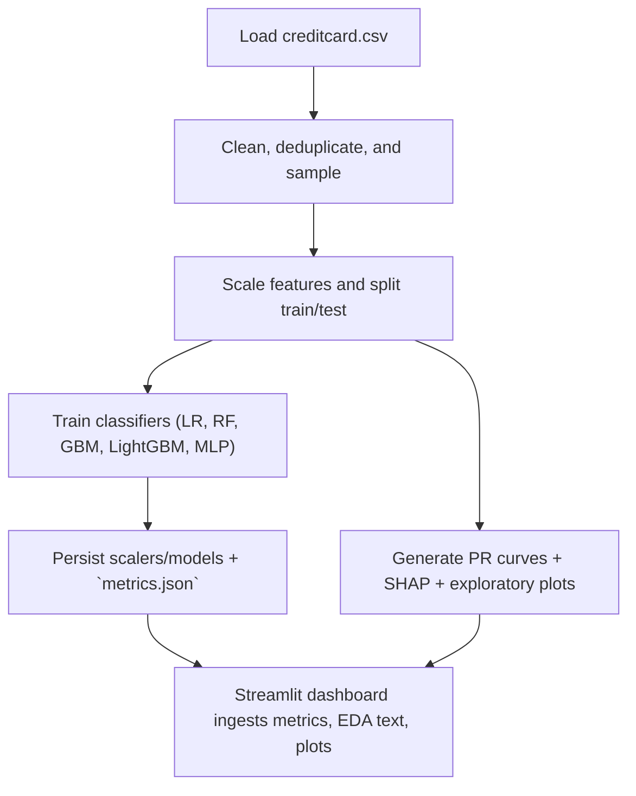
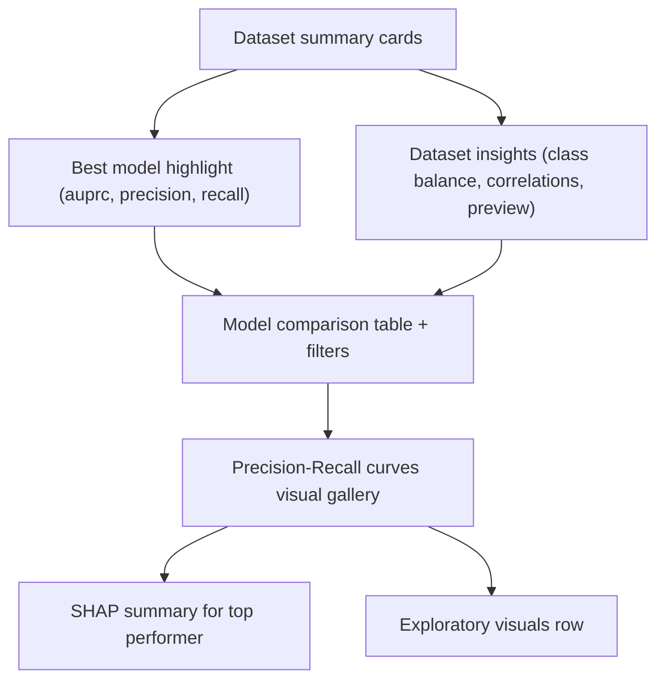

# Credit Card Fraud Detection

This project analyzes the anonymized `creditcard.csv` dataset (284,807 transactions with 492 frauds) to build a reproducible pipeline covering EDA, preprocessing, several classifiers (Logistic Regression, Random Forest, Gradient Boosting, LightGBM, and an MLP), and evaluation that highlights the Area Under the Precision-Recall Curve (AUPRC) instead of accuracy.

## Repository layout

- `creditcard.csv` – raw dataset from the ULB/Worldline research collaboration.
- `requirements.txt` – pinned libraries used across the pipeline, dashboard, and explainability scripts.
- `src/project_pipeline.py` – command-line pipeline that runs sampling, scaling, training, visualizations, SHAP summaries, and metadata exports.
- `reports/eda_summary.md` – automatically generated markdown describing class balance, stats, and top-correlated features.
- `outputs/` – serialized scalers/models (`.joblib`) plus `metrics.json` that stores AUPRC, precision, recall, and classification reports.
- `plots/` – PNGs for class distribution, hourly transaction breakdown, time/amount distributions, boxplots, correlation heatmaps, SHAP summaries, and PR curves.
- `app.py` – Streamlit dashboard that loads the EDA summary, metrics, and visuals for quick inspection.
- `operations.md` – sequence for refreshing the dataset, rerunning the pipeline, and updating the dashboard.

## Setup

1. Create and activate a Python 3.12 (or newer) environment.
2. `pip install -r requirements.txt`

## Running the pipeline

```bash
python src/project_pipeline.py
```

By default the script caps the dataset to 100,000 rows (`--max-samples`) to keep runtime reasonable while preserving the class imbalance structure; set the flag higher (or `0` to disable sampling) if you want to process everything. The command produces:

- `reports/eda_summary.md` with the sample size, class counts, key statistics for `Time`/`Amount`, and the PCA features most correlated with fraud.
- `plots/` with `class_distribution.png`, `hourly_distribution.png`, `time_density.png`, `amount_density.png`, `amount_boxplot.png`, `V17_V14_scatter.png`, `feature_correlations.png`, `shap_summary_<best_model>.png`, and `pr_curve_<model>.png` for every classifier.
- `outputs/metrics.json` (AUPRC, average precision, classification reports), plus saved scaler/model artifacts for each learner.

## Dashboard

To explore the metrics and visuals interactively, launch the Streamlit application:

```bash
streamlit run app.py
```

It reads `reports/eda_summary.md`, `outputs/metrics.json`, and every PNG under `plots/` so you can browse the dataset overview, model comparison table, and generated charts in one place. The dashboard now surfaces dataset summary cards, class-balance and correlation highlights, and a small snapshot of the raw transactions before diving into the model comparisons, plus a quick best-model overview to call out the top AUPRC performer. Precision-recall reports and exploratory visuals render in responsive image grids to keep the wide layout balanced and easy to scan.

## Pipeline overview



## Dashboard layout



## Explainability

After training the models, the pipeline selects the best AUPRC performer and writes a SHAP summary plot (`plots/shap_summary_<model>.png`). Open that image to understand which features most influence the model’s fraud predictions (the same image is visible inside the Streamlit dashboard).


